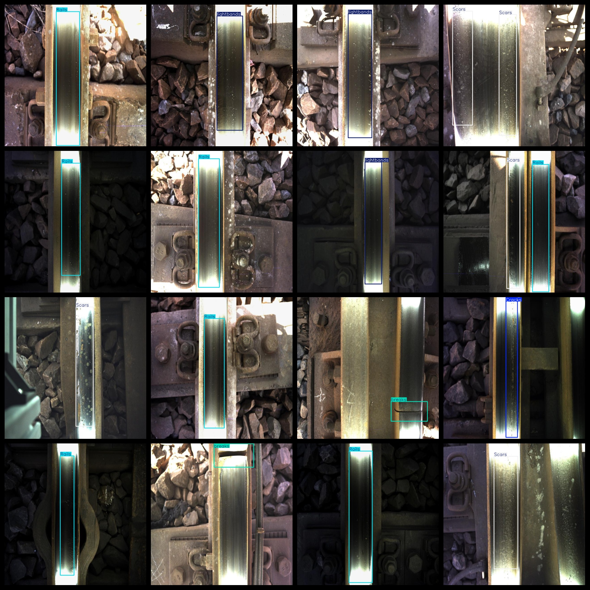
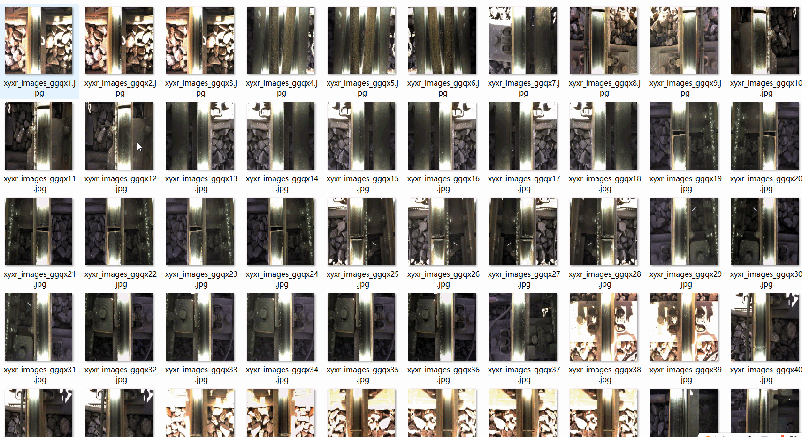

# [Object Detection] Fire Vehicle Rail Defect Dataset 1118 imagesYOLO+VOC format

【Target Detection】The dataset of railway track defects with 1118 images in YOLO+VOC format.

Dataset Format: VOC format + YOLO format

The compressed file contains: three folders, each storing images, xml files, and text files.

Total jpg images in JPEGImages folder: 1118

The total number of XML files in the Annotations folder is 1118.

The total number of txt files in the labels folder is 1118.

Number of tag types: 5

Tag names: ["Cracks","Rails","Scars","breaks","lightbands"]

Tags: ["Crack", "Railway Track", "Scar", "Breakage", "Band"]

The number of boxes for each label (Note that the order of labels in the Yolo format does not correspond to this, but is based on the classes.txt file in the labels folder):

Cracks frame count = 113

Rails frame count = 374

Scars frame count = 431

breaks frame count = 128

lightbands frame count = 290

Total boxes: 1336

Picture clarity (Resolution: Pixels): Clear

Image Enhancement: Yes

Shape of the label: Rectangular box, used for object detection and recognition.

Important Note: None

Special Notice: This dataset does not guarantee the accuracy or precision of the trained models or weight files. The dataset only provides accurate and reasonable annotations.

## Images

---

Here is a pay link on Stripe (https://buy.stripe.com/3cs8yP7sY87d0vu9AB). Please contact me lonlonago@foxmail.com after funding $89, and I will send you a complete data files, thank you!

